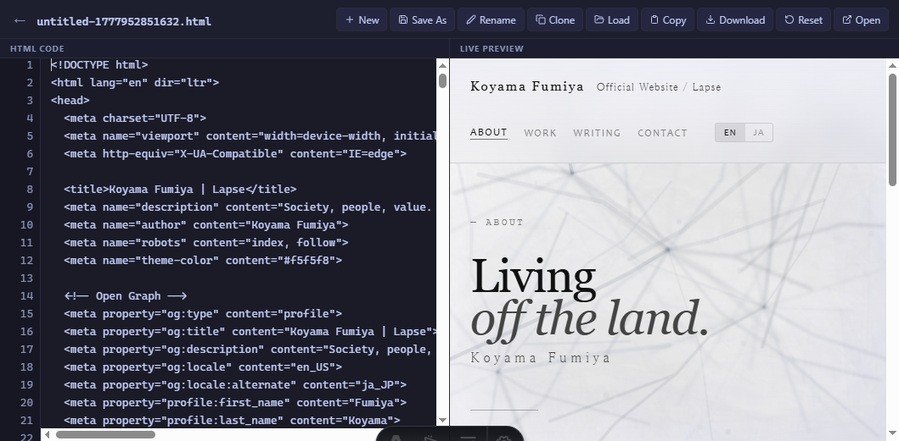

# astro-html-editor

[](https://www.npmjs.com/package/astro-html-editor) [](https://www.npmjs.com/package/astro-html-editor) [](https://yuis-ice.github.io/astro-html-editor/) [](LICENSE)

**[Full documentation →](https://yuis-ice.github.io/astro-html-editor/)**

A self-hosted HTML editor with live preview. Paste or write HTML on the left, see the result on the right. Files are saved to the server filesystem immediately — no localStorage, no manual download step.

Built with Astro SSR and plain JavaScript. No React, Vue, or Svelte.



## Install

```bash
# Run without installing
npx astro-html-editor

# Or install globally
npm install -g astro-html-editor
astro-html-editor
```

Opens at `http://localhost:4321`. Files are saved to `./data/` in the current directory.

## From source

```bash
git clone https://github.com/yuis-ice/astro-html-editor
cd astro-html-editor
npm install
npm run build
npm start
```

For development (hot reload):

```bash
npm run dev
```

## Features

- Split-pane editor (textarea) + live preview (iframe srcdoc)
- Server-side file persistence via `node:fs` — survives browser crashes
- Immediate sync on paste, debounced sync on keystroke (800ms)
- Atomic writes (`tmp` → `fs.rename`) to prevent partial saves
- File management: New, Save As, Rename, Clone, Load, Copy, Download, Reset, Open in new window
- Files organized under `data/YYYY-MM/` with URL-based routing (`/file/YYYY-MM/name`)
- Tab key inserts 2 spaces; Ctrl+S triggers immediate save
- Line-number gutter synced to scroll position
- Dark theme (Tokyo Night palette)

## Self-Hosting

Files are written to `./data/YYYY-MM/` relative to the working directory. Mount a persistent volume at `./data/` if running in Docker.

The `/api/*` endpoints have no authentication. Do not expose the server to the public internet without adding your own access control (reverse proxy, firewall rule, etc.).

Set `PORT` to change the port:

```bash
PORT=8080 astro-html-editor
```

## API Endpoints

| Method | Path | Description |
|--------|------|-------------|
| `POST` | `/api/sync` | Write file to disk |
| `GET` | `/api/files` | List saved files with byte sizes |
| `POST` | `/api/new` | Create file with default template, return slug |
| `POST` | `/api/rename` | Rename file on server |
| `POST` | `/api/clone` | Duplicate file, return new slug |

## Contributing

See [CONTRIBUTING.md](CONTRIBUTING.md).

## License

Apache 2.0
